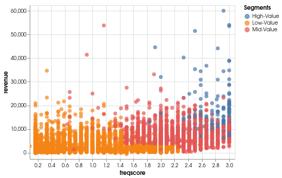

# Segmentation-Data-Challenge

This data challenge contained a .csv file with credit card user data and the goal was to simply segment the users so that a credit card company could develop more targeted marketing for each type of user. 

## Jupyter Notebook

The notebook contains metadata from the .csv file, exploratory data analysis (EDA), k-means clustering with descriptions of analytical decisions, and some recommendations for the credit card company.

## Slides

The google slides provide a summary of the decisions made in this challenge. 

## About Me

This challenge was completed while a Data Science Fellow at Insight Data Science, Boston
